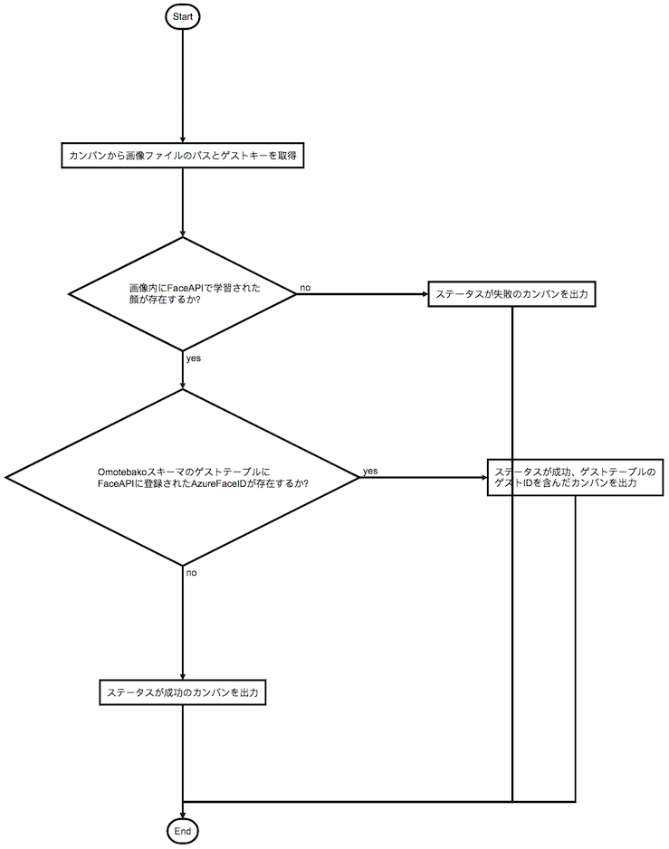

# azure-face-api-identifier-kube-golang
## 概要  
1枚の画像を Azure Face API(Detect) にかけ、返り値として、画像に映っているすべての人物の顔の位置座標(X軸/Y軸)、性別・年齢等の情報を取得します。  
Azure Face API の仕様により、顔の位置座標を形成する長方形の面積が最も広い顔が先頭に来ます。  
この仕様を利用して、その先頭の顔の FaceIDの 情報 を取得・保持します。  
最後に、取得・保持されたFaceIDを、SQLに保存された登録済みの顔IDと照らし合わせ、SQLに存在すれば登録済み既存ユーザーと判定し、存在しなければ新規ユーザーと判定します。  
なお、本マイクロサービスは、顔認証のデータ解析のために、ログデータを出力します。

参考：Azure Face API の Person Group は、Azure Face API ユーザ のインスタンス毎に独立した顔情報の維持管理の単位です。  
参考：1枚の画像に対して複数の顔が存在する場合は、1番確証度が大きい顔に対して判定を行います。  

## 前提条件  
Azure Face API サービス に アクセスキー、エンドポイント、Person Group を登録します。  
登録されたエンドポイント、アクセスキー、Person Group を、本リポジトリ内のmain.goに記載してください。  

## Azure Face API(Detect) の テスト実行  
Azure Face API(Detect) の テスト実行 をするときは、sample/test_01.jpgに任意の顔画像を配置してください。  
Azure FAce API 登録されているエンドポイントを、事前に学習させます。下記の手順で学習させることができます。  
```
# shellディレクトリ内のrecreate-group.shを実行します。シェル内のENDPOINT, SUBSCRIPTION_KEY, PERSON_GROUP_IDは使用するFaceAPIのエンドポイントに応じて書き換えて下さい。
$ bash recreate-group.sh
# 上記のコマンド実行するとPerson_idが出力されるので、train.shの3行目のPERSON_IDの値を置換しシェルを実行して下さい。
$ bash train.sh
```
* SQLにface_id_azure (TEXT), guest_id (INT) カラムを持つguestテーブルを作成しておきます。  
* `shell/setup-env.sh`　は、face-api-config.jsonと.envを作成するためのシェルスクリプトです。    

## Requirements（Azure Face API の Version 指定)    
azure-face-api の version を指定します。  
本レポジトリの main.go では、下記のように記載されています。  
```
Azure/azure-sdk-for-go/services/cognitiveservices/v1.0/face"

```

## autorest の Version  
Azure Face API で使用する autorestのバージョン指定は、関連ソースコードとともに、go.mod の中にあります。  
```
Azure/go-autorest/autorest v0.11.22
```

## I/O
#### Input
入力データのJSONフォーマットは、src/common/common.go にある通り、次の様式です。
```
 {
	for index, value := range message.Data() {
		if index == "image_path" {
			setPersonParam.ImgPath = value.(string)
		}
		if index == "guest_key" {
			setPersonParam.RedisKey = value.(string)
		}
	}
}
```
1. 顔画像のパス(image_path)  
入力顔画像のパス  
2. 顧客ID(faceID)  
(エッジ)アプリケーションのface ID???   

#### Output1
出力データのJSONフォーマットは、src/common/common.go にある通り、次の様式です。
```
{
		data.ConnectionKey = "response"
		data.Result = true
		data.RedisKey = 1
		data.FilePath = "image"
		data.Person = identifyResult
		data.GuestID = 1
		data.Status = "existing"
}
```
#### Output2
ログデータ(顔認証ログデータ解析用)のJSONフォーマットは、main.go にある通り、次の様式です。
```
{
			"imagePath": setPersonParam.ImgPath,
			"faceId":    faceID,
			"responseData": map[string][]face.IdentifyCandidate{
				"candidates": candidateList,
			},
		}
```

## Getting Started
1. 下記コマンドでDockerイメージを作成する。  
```
make docker-build
```
2. main.goに設定を記載し、AionCore経由でKubernetesコンテナを起動する。  
main.goへの記載例   
```
var apiKey = os.Getenv("API_KEY")
var endpoint = os.Getenv("ENDPOINT")
var rabbitmqURL = os.Getenv("RABBTIMQ_URL")
var queueOrigin = os.Getenv("QUEUE_ORIGIN")
var queueTo = os.Getenv("QUEUE_TO")
var SERVICE_NAME = os.Getenv("SERVICE_NAME")
var DSN = os.Getenv("DATA_SOURCE_NAME")
var setPersonParam model.SetPersonParam
var logging = logger.NewLogger()
```
## Flowchart
